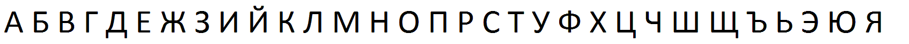
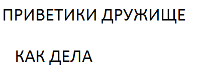
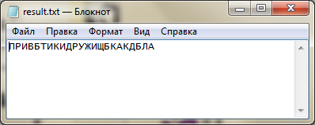

# characterRecognizer
распознавание текста с изображения

### Функционал:
- хранение алфавита в динамическом списке
- интерполяция до изображения букв алфавита
- соотнесение образца и буквы

### Примеры:
###### Алфавит
<h4 align="center">
  
</h4>

###### Изображение с текстом
<h4 align="center">
  
</h4>

###### Распознанный текст (интерполяция на данный момент приводит к тому, что «Е» становится больше похожа на «Б»
<h4 align="center">
  
</h4>
